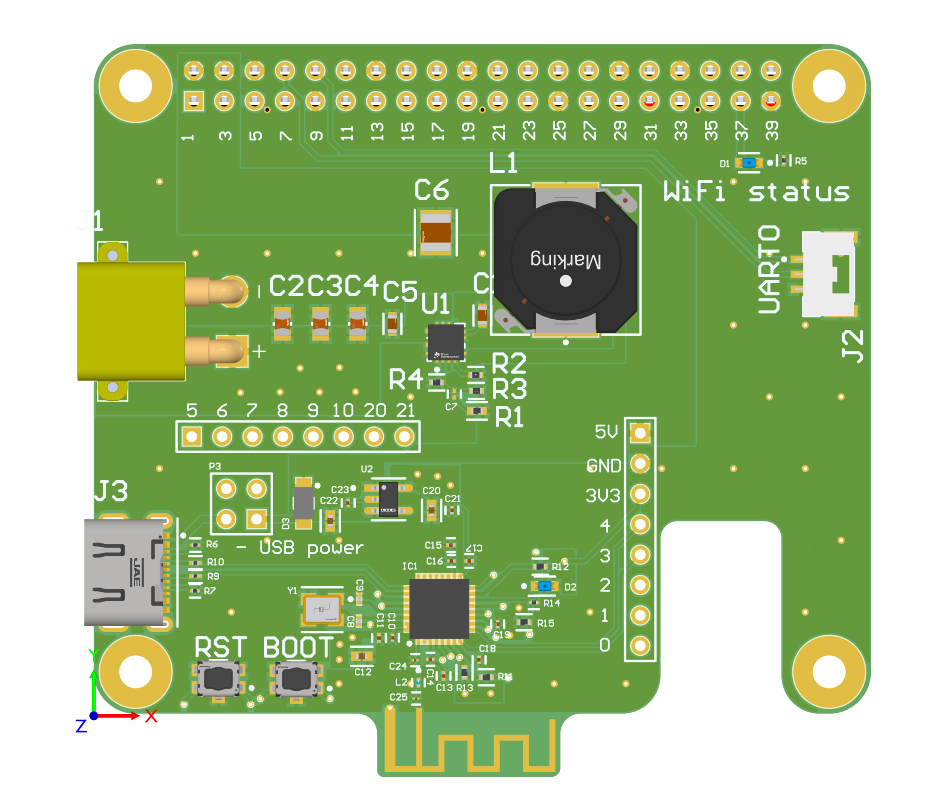

# Raspberry pi hat
## Project Goal

The goal of this project was to create a Raspberry Pi HAT equipped with a power converter for powering the Raspberry Pi, as well as an ESP32 module with a Wi-Fi antenna for communication with other devices using the ESP-NOW protocol. Communication and data exchange between the ESP32 and the Raspberry Pi are implemented via the UART protocol.

## Implementation

The project was designed using Altium Designer, including all schematics and PCB layouts.

## Power Supply Section

The power supply section was designed using WEBENCH Power Designer from Texas Instruments. The design parameters for the power section were:

Input voltage: 14 V ~ 25.2 V
Output voltage: 5.1 V
Output current: 5 A

All requirements were met. The design uses a buck converter based on the TPS56637RPAR, which supports an input voltage range from 4.5 V to 28 V and a maximum output current of 6 A. As the inductive component, the Wurth Elektronik 7447706033 inductor was selected, featuring a maximum saturation current of 9.4 A and a resistance of 7.5 mΩ.

## ESP32 Section

The project uses the ESP32-C3 microcontroller, responsible for wireless communication using the ESP-NOW interface. Device programming is performed via USB using a USB-C connector. Communication with the Raspberry Pi is implemented through the UART protocol, allowing the onboard computer to send commands and receive data from the microcontroller.

The project uses a PCB antenna designed according to the AN043 application note. To meet the differential impedance requirements of the USB interface, a 4-layer PCB was used in the design.

## Project Result

The PCB project looks as follows:
